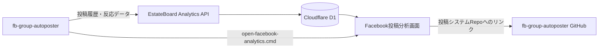

# Facebook投稿分析ダッシュボード

このリポジトリからも、EstateBoard側の共通分析画面を直接参照できます。

## 開く場所

- 分析ダッシュボード: https://estateboard.pages.dev/facebook-analytics/
- 既存EstateBoard: https://estateboard.pages.dev/
- EstateBoardリポジトリ: https://github.com/univcorp2-ctrl/EstateBoard

## 投稿PCからワンクリックで開く

リポジトリ直下の `open-facebook-analytics.cmd` をダブルクリックします。

Windowsデスクトップへショートカットを作る場合:

```powershell
powershell -ExecutionPolicy Bypass -File scripts\install_dashboard_shortcut.ps1
```

接続状態だけ確認する場合:

```powershell
.venv\Scripts\python.exe scripts\open_analytics_dashboard.py --status
```

## 役割分担



画面の実装はEstateBoardに一本化されています。このリポジトリには、同じ画面へ安全に移動するランチャーとデータ送信・反応取得処理を置いています。画面を二重実装しないため、数字の定義や表示が食い違いません。

## URLを変更する場合

`.env` で上書きできます。

```dotenv
ANALYTICS_DASHBOARD_URL=https://estateboard.pages.dev/facebook-analytics/
ESTATEBOARD_URL=https://estateboard.pages.dev/
ANALYTICS_HEALTH_URL=https://estateboard.pages.dev/api/analytics/health
```
