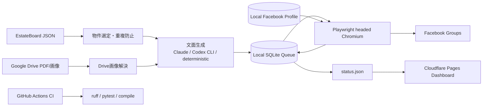

# Facebook Group Property Autoposter

EstateBoardの最新物件を選び、グループごとの重複・日次上限・投稿時間を守りながら、ログイン済みFacebookブラウザへ画像付きで投稿するWindows向け運用システムです。投稿結果はSQLiteに保存し、Cloudflare Pagesのステータス画面へ公開します。

## 2026-07 復旧内容

停止原因は、Google Drive同期フォルダ内の仮想環境が参照していたPlaywright Chromiumの消失と、同じ同期領域に置かれたChrome persistent profile／SQLite／Gitメタデータの破損でした。さらにEstateBoard変換後の `images` が空で、Driveに保存済みの物件画像が投稿処理へ渡っていませんでした。

今回の修復で次を本線へ統合しました。

- 実行コード、venv、Facebook profile、SQLiteを `%LOCALAPPDATA%\FBGroupAutoposter` へ分離
- 使用中venvに合うPlaywright Chromiumを再インストール
- EstateBoard物件ID・物件名からGoogle Drive画像を解決し、投稿へ添付
- 朝・昼・夕方・夜の安全なフォールバックタスクを再登録
- 投稿結果を `site/data/status.json` に書き出し、Cloudflare Pagesへ反映
- Claude APIなしでもテンプレートで継続。`POST_TEXT_PROVIDER=codex` ならCodex CLIを文面生成に利用
- preflight、pytest、ruff、GitHub Actions、devcontainerを維持

## アーキテクチャ



重要: Facebook投稿は、ログイン済みのheaded browserと対話ユーザーセッションを必要とします。GitHub-hosted runnerやCloudflare上ではなく、Windows Task Schedulerまたは対話モードのself-hosted runnerで実行します。Codex CLIは文章作成の代替であり、Facebookログインやブラウザ操作を置き換えるものではありません。

## 最短復旧

管理者PowerShellでリポジトリを開き、次を1回実行します。

```powershell
powershell -ExecutionPolicy Bypass -File scripts\repair_windows_runtime.ps1
```

Codex CLIを使う場合:

```powershell
powershell -ExecutionPolicy Bypass -File scripts\repair_windows_runtime.ps1 -PostTextProvider codex
```

スクリプトはローカルランタイム作成、既存profile／DB履歴の初回移行、依存関係とChromiumの修復、preflight、テスト、Windowsタスク登録まで行います。Facebookがcheckpoint、CAPTCHA、2段階認証を要求した場合だけ、同じWindowsユーザーで `scripts/login_once.py` を開いて認証を完了してください。

## 日次運用

- 08:00 session keepalive
- 09:30 morning post（ログオン時catch-upあり）
- 13:00 / 16:30 / 20:30 fallback run
- 11:30 / 21:30 live permalink verification
- 12:00 / 23:00 monitoring

同一グループはJSTの同日内に1回だけ、投稿済み／要確認は重複対象として扱うため、フォールバックが複数回動いても過剰投稿しません。

## 設定

秘密値は `.env` に置き、Gitへcommitしません。主な項目:

```dotenv
DRY_RUN=false
AUTO_APPROVE=true
ESTATEBOARD_SOURCE=G:\マイドライブ\AI_Agents\github\repos\EstateBoard\output\received\properties.json
ESTATEBOARD_DRIVE_ROOT=G:\マイドライブ\0.物件資料_お客様紹介用\Estateboard
POST_TEXT_PROVIDER=
ANTHROPIC_API_KEY=
TELEGRAM_BOT_TOKEN=
TELEGRAM_CHAT_ID=
```

`POST_TEXT_PROVIDER` が空なら既存Claude設定を優先し、APIキーがない場合は安全な決定論的テンプレートへフォールバックします。`codex` を指定した場合は、Codex CLIのログイン済みセッションを使います。

## 確認コマンド

```powershell
& "$env:LOCALAPPDATA\FBGroupAutoposter\.venv\Scripts\python.exe" "$env:LOCALAPPDATA\FBGroupAutoposter\app\scripts\preflight_drive.py"
Get-ScheduledTask -TaskName 'FBAutoposter-*' | Format-Table TaskName,State,LastRunTime,LastTaskResult
```

手動dry-runは `.env` の `DRY_RUN=true` で `run_daily_drive.py` を実行します。本番投稿では `DRY_RUN=false` とし、投稿後に公開ダッシュボード、Telegram通知、SQLite permalinkを照合します。

詳細は [docs/setup.md](docs/setup.md) と [docs/architecture.md](docs/architecture.md) を参照してください。
