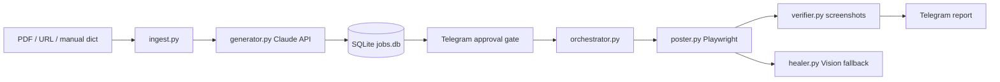

# fb-group-autoposter

Facebook非公開グループ向けの物件配信パイプラインです。物件PDF/URL/dict入力、Claude APIによるグループ別文面生成、SQLiteキュー、Telegram承認ゲート、Playwright投稿エンジン、検証・通知・ヘルスチェックを含みます。

初期値はフェイルセーフです。

- `DRY_RUN=true`: 実投稿しない
- `AUTO_APPROVE=false`: Telegram承認必須
- Facebookパスワードは保存しない
- `.env`, `profiles/`, `logs/`, `screenshots/`, `jobs.db` はgit管理しない

## Architecture



詳細は [`docs/architecture.md`](docs/architecture.md) を参照。
深掘り検証は [`docs/deep_verification.md`](docs/deep_verification.md) を参照。

## 初回セットアップ

```powershell
python -m venv .venv
.venv\Scripts\activate
pip install -r requirements.txt
playwright install chromium
copy .env.example .env
```

`.env` に実値を入れます。

```dotenv
ANTHROPIC_API_KEY=...
TELEGRAM_BOT_TOKEN=...
TELEGRAM_CHAT_ID=...
DRY_RUN=true
AUTO_APPROVE=false
```

`groups.yaml` のダミーIDを実グループ情報に差し替えます。

```powershell
python scripts/login_once.py
python scripts/run_pipeline.py --selftest
```

`login_once.py` は `profiles/main` を `user_data_dir` として使います。開いたブラウザで手動ログインし、2FA/checkpointも手動で完了します。以後、本番投稿は同じプロファイルを再利用します。

## 通常運用

```powershell
python scripts/run_pipeline.py
python scripts/approval_listener.py
python scripts/healthcheck.py
```

Windowsタスクスケジューラ登録:

```powershell
powershell -ExecutionPolicy Bypass -File scripts\install_windows_tasks.ps1
```

登録されるタスク:

- `FBGroupAutoposter-Pipeline`: 1時間ごとにキュー処理
- `FBGroupAutoposter-ApprovalPoll`: 5分ごとにTelegram callback取得
- `FBGroupAutoposter-Healthcheck`: 30分ごとにheartbeat確認

## Hiroが次にやること

1. `.env` に `ANTHROPIC_API_KEY`, `TELEGRAM_BOT_TOKEN`, `TELEGRAM_CHAT_ID` を入れる。
2. `groups.yaml` に実際のグループID、URL、規約、禁止語、署名を入れる。
3. `python scripts/login_once.py` でFacebookへ手動ログインする。
4. `python scripts/run_pipeline.py --selftest` を実行する。
5. `DRY_RUN=true` のままTelegram承認フローを確認する。
6. 問題なければ `DRY_RUN=false` に変えて本投稿開始。
7. 安定後に `AUTO_APPROVE=true` へ変えて完全無人化。

## 入力

- `data/inbox/*.pdf`: PyMuPDFでテキスト抽出。抽出失敗時もraw_textで続行。
- `data/inbox/*.json`: PropertyData dictとして投入。
- `ingest_url(url)`: URL本文をraw_textとして取り込み。
- `ingest_manual(dict)`: 既存スクレイパー出力を直接投入。

## 承認ゲート

手動モード:

- Telegramにプレビュー送信
- ボタン: `✅承認`, `✏️修正`, `❌却下`, `👁️全文`
- 承認で `approved`
- 却下で `rejected`
- 全文で全グループ分を分割送信

自動モード:

- `AUTO_APPROVE=true` でプレビュー通知後に即 `approved`
- `degraded=true` の簡易生成ジョブは `AUTO_APPROVE_SKIP_DEGRADED=true` の場合、人間承認待ち

## 投稿エンジン

`poster.py` は以下を実装します。

- Playwright persistent context (`PROFILE_DIR=profiles/main`)
- 投稿前の `is_logged_in()`
- 複数セレクタ候補
- Visionフォールバック (`healer.py`)
- 操作単位リトライ
- グループ単位隔離
- daily limit / same group interval / active hours
- 投稿後スクショ保存
- 成否不明時は `uncertain` として再投稿しない

## テスト

通常テスト:

```powershell
pytest
ruff check .
```

10回連続検証:

```powershell
python scripts/run_tests_10.py
```

50回連続の深掘り検証:

```powershell
python scripts/run_tests_50.py
```

100回など任意回数:

```powershell
python scripts/run_tests_50.py --rounds 100
```

CIでは実投稿しないテストのみ実行します。

## 手動E2E

実投稿確認はHiroが自分の検証用グループで1回だけ実施します。

1. 検証用Facebookグループを1つ用意。
2. `groups.yaml` をそのグループだけ `enabled:true` にする。
3. `.env` は `DRY_RUN=false`, `AUTO_APPROVE=false`。
4. `python scripts/login_once.py` でログイン。
5. `data/inbox/` にテストJSONまたはPDFを置く。
6. `python scripts/run_pipeline.py`。
7. Telegramで承認。
8. 投稿結果・スクショ・DB状態を確認。

## 法務・リスク

Facebookの自動操作は規約上のリスクがあり、アカウント制限やグループ投稿制限の可能性はゼロではありません。リスク低減のため、投稿頻度を抑える、投稿対象グループを絞る、各グループ規約を尊重する、投稿専用アカウントの分離を検討することを推奨します。

本システムは安全側のデフォルト、承認ゲート、投稿頻度制限、セッション切れ停止、checkpoint停止、成否不明時の再投稿抑止を提供します。最終的な運用判断はHiroが行います。

## 未完了項目

初期構築範囲では、AdsPower実接続、既存スクレイパー固有連携、Obsidian週次レポート生成は拡張口のみです。`BROWSER_BACKEND=adspower` は予約値で、初期実装では `NotImplementedError` を返します。
