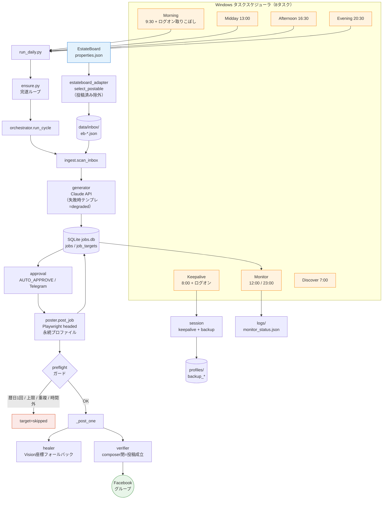
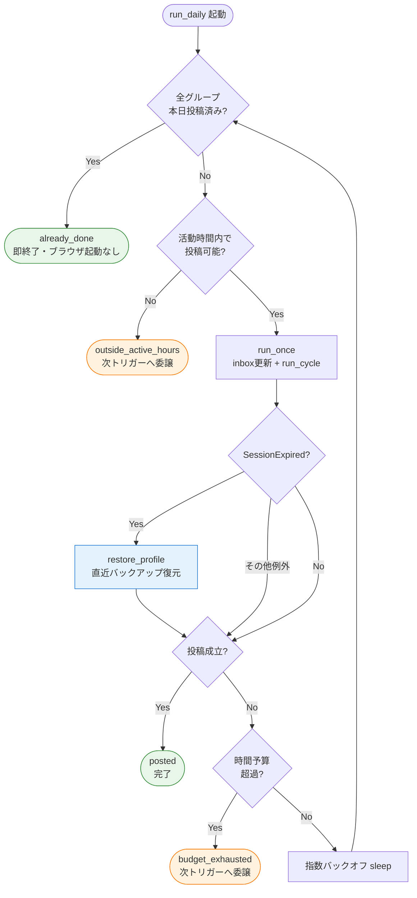
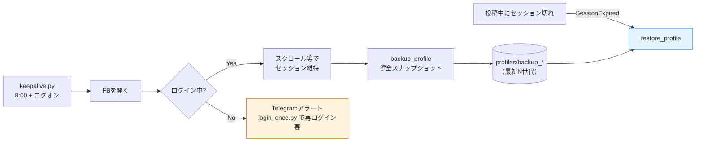
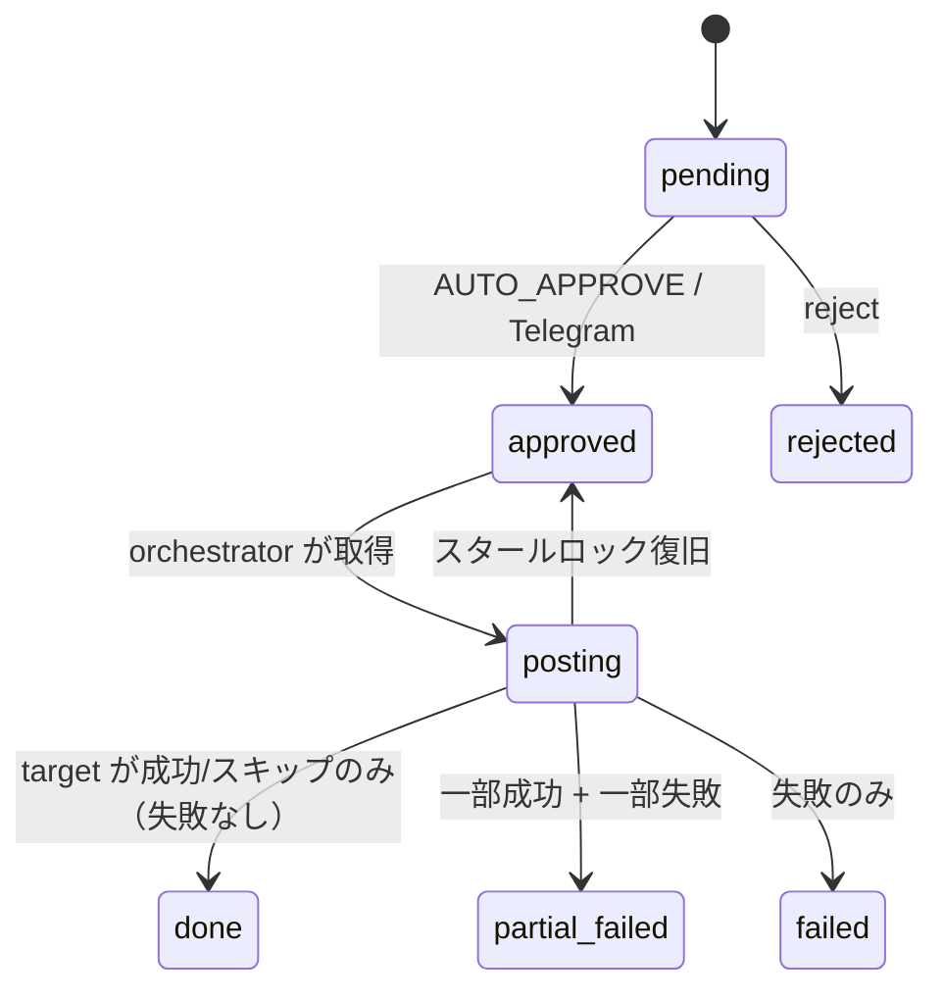

# Architecture

物件情報の取得 → Claudeによる文面生成 → SQLiteキュー → 承認ゲート → Playwright投稿 →
投稿後検証 → ヘルスチェックを、**「毎日必ず1回・重複なし・止まらず完遂」** で回すパイプライン。

---

## 1. 全体データフロー

---

## 2. 完遂ループ（`ensure.py` — 投稿を完遂するまで止まらない）

各トリガーが `run_daily.py` を起動し、`ensure_posted_today` が回す。すべての再試行は
**JST暦日1回ガード**により冪等（何度走っても二重投稿しない）。

**多重トリガーで取りこぼさない**：Morning（＋ログオン取りこぼし）/ Midday / Afternoon / Evening
のどれか1つが成功すれば、残りは暦日ガードでスキップ。1回の `budget_exhausted` でも次のトリガーが続行する。

---

## 3. セッション維持と自動復旧

ヘッドありブラウザ＝ログオン中のみ実行（ブロック回避のための意図的設計）。
セッションは温め続け、健全時にスナップショットし、切れたら自動復元する。

---

## 4. ジョブ／ターゲットの状態遷移と冪等性

`jobs` は配信単位、`job_targets` はジョブ×グループ単位。`UNIQUE(job_id, group_id)` で二重登録を防ぐ。

- **target状態**：`pending / posted / uncertain / skipped / failed`。
- **`uncertain`** は「ほぼ公開された」とみなし `posted_at` を刻む → ガードが再投稿を防ぐ（ブロック回避優先）。
- **`skipped`**（ガードによる正常な「何もしない」）は失敗扱いしない。
- **冪等性の要＝暦日1回ガード** `posted_same_group_today`：同一グループはJST暦日で1回まで。
  朝に投稿→夜はスキップ。時間ベース間隔は投稿時刻が日々後退して丸1日抜けるため不採用。

---

## 5. 多層フォールバック（投稿をミスしない）

| 層 | 仕組み |
|----|--------|
| 操作レベル | セレクタ配列を順試行 → 失敗時 `healer.py` がVisionで座標特定 → 操作単位で指数バックオフ再試行 |
| セッション | `keepalive` で維持＋健全バックアップ、切れたら `restore_profile` で自動復元して再試行 |
| 実行レベル | `ensure` 完遂ループが活動時間内は成立まで再試行、予算切れは次トリガーへ委譲 |
| スケジュール | Morning＋ログオン取りこぼし＋Midday＋Afternoon＋Evening の多重トリガー |
| グループ隔離 | グループ単位で連続失敗を計数し、閾値で `enabled:false` 検討をTelegram通知 |
| 安全停止 | 投稿制限 / checkpoint 検知時は当日の残投稿を止めて通知（暴走しない） |
| 監視 | `monitor.py` が26h投稿なしで stalled 判定、`session_status.json` で健全性記録 |

---

## 6. Secrets / 拡張点

実値はrepoに置かない（`.env.example` のキー名のみ）：`ANTHROPIC_API_KEY` / `TELEGRAM_BOT_TOKEN` / `TELEGRAM_CHAT_ID`。
`.env` `profiles/` `logs/` `screenshots/` `data/jobs.db` はgit管理外。

- `BROWSER_BACKEND=adspower`：将来のCDP接続差し替え口として予約。
- `ingest.py`：既存スクレイパー出力dictを `ingest_manual()` で受け取れる（SSRFガード付きURL取得も）。
- 1日2回投稿したい場合は `groups.yaml` にグループを2つ以上登録（同一グループ2回はブロックリスクのため避ける）。
