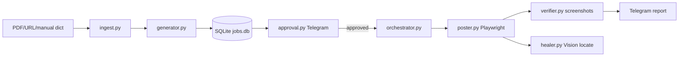
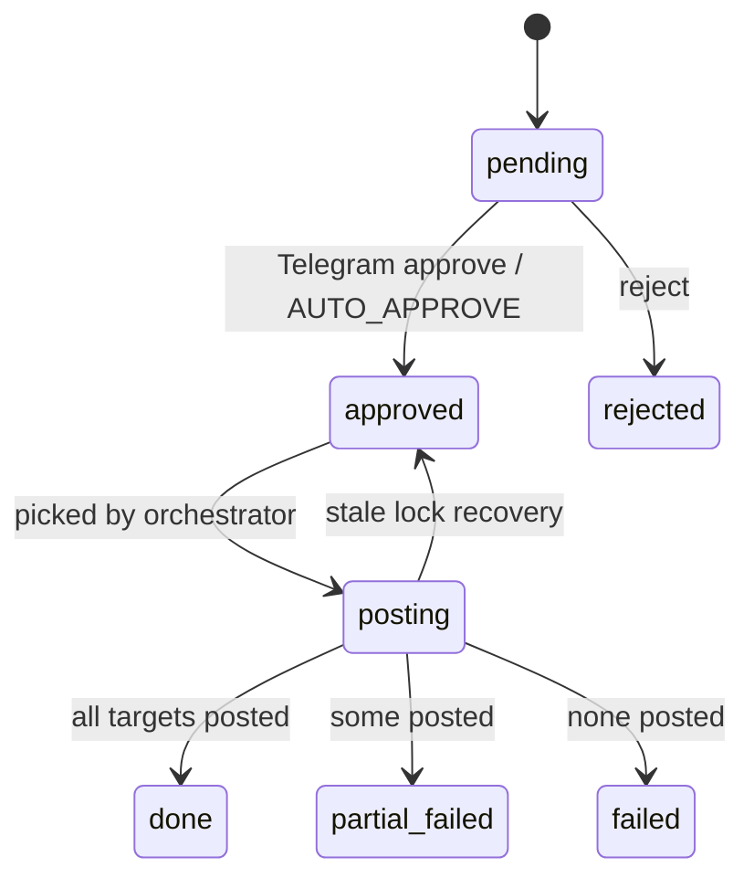

# Architecture

## 全体像

このrepoは、物件情報の入力、Claude APIによる文面生成、SQLiteキュー、Telegram承認ゲート、Playwright投稿エンジン、投稿後検証、ヘルスチェックを1本のパイプラインとして実装する。

## 状態管理

`jobs` は配信単位、`job_targets` はジョブ×グループ単位。`UNIQUE(job_id, group_id)` で二重登録を防ぐ。投稿成功済みtargetは再実行時にスキップされる。

## フォールバック

1. セレクタ配列を順番に試す。
2. 全セレクタ失敗時は `healer.py` がVisionモデルで画面要素を座標特定する。
3. 操作単位で指数バックオフ再試行する。
4. グループ単位で失敗を隔離し、連続失敗閾値で `enabled:false` 検討通知を出す。
5. セッション切れ、checkpoint、投稿制限は安全停止しTelegramに通知する。

## Secrets

実値はrepoに置かない。`.env.example` のキー名だけを使用する。

- `ANTHROPIC_API_KEY`
- `TELEGRAM_BOT_TOKEN`
- `TELEGRAM_CHAT_ID`

## 拡張点

- `BROWSER_BACKEND=adspower` は将来のCDP接続差し替え口として予約。
- `ingest.py` は既存SUUMO/AtHome/HOME'Sスクレイパー出力dictを `ingest_manual()` で受け取れる。
- 週次Obsidianレポートは `job_targets` の投稿履歴から生成可能。
