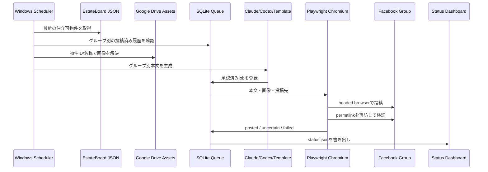

# Architecture

## Production boundary

Facebook側の認証cookie、browser profile、SQLiteキューはWindows端末の `%LOCALAPPDATA%\FBGroupAutoposter` にのみ置きます。Google DriveはEstateBoardが取得したPDF・画像の入力保管庫としてread-onlyで参照します。GitHub／Cloudflareには秘密値、cookie、投稿本文、スクリーンショットを公開しません。

## Failure containment

- Chromium消失: repair scriptが現在のvenvに再インストール
- Drive同期障害: 画像なしtext-only投稿へ縮退
- Claude/Codex障害: deterministic templateへ縮退
- Facebook checkpoint: 自動再試行を止め、sentinel／Telegramで人へ通知
- verify不能: `uncertain` として重複投稿を防止
- PC停止: `StartWhenAvailable` とログオン時catch-upで復帰

## CI/CD

GitHub ActionsはLinux上でruff、pytest、compileall、静的dashboard artifactを検証します。実Facebook投稿はWindows対話セッション専用です。`windows-runtime.yml` はラベル付きself-hosted runnerがある場合だけ、preflight／dry-run／live-runの遠隔制御に使えます。Cloudflare Pagesは `site/` をそのまま配信します。
