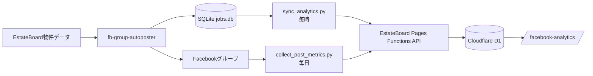

# EstateBoard Facebook投稿分析連携

## 目的

既存の投稿キュー `data/jobs.db` を正本として、投稿先、物件、成否、投稿URL、反応数、コメント数、シェア数、表示数を EstateBoard の分析画面へ同期します。投稿処理本体には手を加えず、履歴同期と反応収集を独立タスクにしているため、分析APIの停止がFacebook投稿を止めることはありません。



## 追加環境変数

```dotenv
ANALYTICS_SYNC_ENABLED=true
ANALYTICS_BASE_URL=https://estateboard.pages.dev
ANALYTICS_INGEST_TOKEN=Cloudflare側と同じ長いランダム値
ANALYTICS_HTTP_TIMEOUT=30
ANALYTICS_METRICS_HEADLESS=false
ANALYTICS_METRICS_MAX_POSTS=30
ANALYTICS_METRICS_MAX_AGE_DAYS=180
```

`ANALYTICS_INGEST_TOKEN` はGitHubへコミットしません。ローカルPCの `.env` とCloudflare PagesのSecretだけに保存します。

## 初回バックフィル

`ANALYTICS_SYNC_ENABLED=true` にした後、次を1回実行すると `jobs.db` に残っている過去の全投稿対象が冪等に同期されます。

```powershell
.venv\Scripts\python.exe scripts\sync_analytics.py
```

同じデータを何度送っても `job_id + group_id` で更新され、重複投稿件数にはなりません。

## 自動実行

```powershell
powershell -ExecutionPolicy Bypass -File scripts\install_analytics_tasks.ps1
```

登録内容:

- `FBGroupAutoposter-AnalyticsSync`: 1時間ごとに投稿履歴を同期
- `FBGroupAutoposter-MetricsCollect`: 毎日00:30に反応数を収集

反応収集は既存の `PROFILE_DIR` を使ってFacebookを開きます。投稿処理と同時起動するとChromiumプロファイルがロックされるため、00:30の収集時間に投稿タスクを重ねないでください。

## 取得できる数字

- 成功、失敗、確認待ち、スキップ
- FacebookグループID、名称、URL
- 物件ID、物件名、EstateBoard URL
- Facebook投稿URL
- リアクション、コメント、シェア、表示数
- 取得時刻ごとのメトリクススナップショット

FacebookのDOMや表示文言は変更されるため、反応収集はベストエフォートです。取得不能でも投稿履歴同期は継続し、ダッシュボード上の過去値は消えません。
