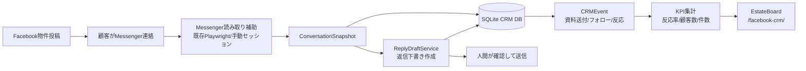

# Messenger CRM Phase 1

## 目的

物件投稿後に Facebook Messenger へ来た問い合わせを、返信下書き・CRMイベント・EstateBoard可視化までつなげる第一段階の縦切りです。

この実装は安全側の設計です。Messenger画面からの読み取りや下書き生成を前提にしますが、送信の自動実行、ブロック回避、CAPTCHA/本人確認の迂回、検知回避のためのフィンガープリント偽装は扱いません。返信は `pending_approval` として保存し、最終送信は人間が確認して行います。

## 追加した責務

| 場所 | 役割 |
|---|---|
| `messenger/src/messenger_crm/models.py` | 会話・メッセージ・返信下書き・CRMイベントの標準モデル |
| `messenger/src/messenger_crm/drafts.py` | 顧客メッセージから返信下書きを決定論的に作成 |
| `messenger/src/messenger_crm/repository.py` | SQLiteへ顧客・会話・メッセージ・下書き・イベントを保存 |
| `messenger/src/messenger_crm/analytics.py` | 返信件数、資料送付数、フォロー数、反応率を集計 |
| `messenger/scripts/messenger_crm_demo.py` | デモデータでEstateBoard連携用JSONを出力 |
| `messenger/tests/test_messenger_crm_phase1.py` | 下書き、DB、KPI集計の自動テスト |

## 全体アーキテクチャ



## 処理フロー

1. 既存のMessenger読み取り処理が1対1スレッドを取得する。
2. 取得結果を `ConversationSnapshot` に変換する。
3. 最新メッセージが顧客からの場合だけ `ReplyDraftService` が下書きを作る。
4. 下書きは `pending_approval` としてSQLiteに保存する。
5. 資料送付・フォロー・顧客返信などを `CRMEvent` として保存する。
6. `export_estateboard_payload()` がEstateBoard表示用JSONを生成する。
7. EstateBoard側の `/facebook-crm/` 画面で顧客数、下書き数、回収率を可視化する。

## GPT Image用のアーキテクチャ画像プロンプト

READMEや提案資料に画像を入れる場合は、最新のGPT Imageモデルで次のプロンプトを使います。

> 日本語のSaaSアーキテクチャ図。左から「Facebook物件投稿」「Messenger問い合わせ」「読み取り補助」「返信下書き」「SQLite CRM」「EstateBoard CRMダッシュボード」。送信は自動ではなく「人間承認」を赤い安全ゲートで表現。KPIとして顧客数、返信下書き数、資料送付数、反応率を右側カードで表示。白背景、青と緑のアクセント、初心者にも分かる矢印付き。

## 実行例

```bash
cd messenger
python scripts/messenger_crm_demo.py
pytest tests/test_messenger_crm_phase1.py
```

デモを実行すると `output/messenger_crm_snapshot.json` にEstateBoard連携用のサンプルJSONが出力されます。

## 本番に必要なもの

- Messengerログイン済みの手動セッション。2FAや本人確認は必ず人間が完了します。
- CRM保存用SQLite DBパス。例: `messenger/data/messenger_crm.db`
- EstateBoardへ同期する場合の取り込みエンドポイントとトークン。Secret名のみ `.env` に置き、実値はGitHubへ保存しません。
- 返信送信前の人間承認運用。初期段階では自動送信しません。
