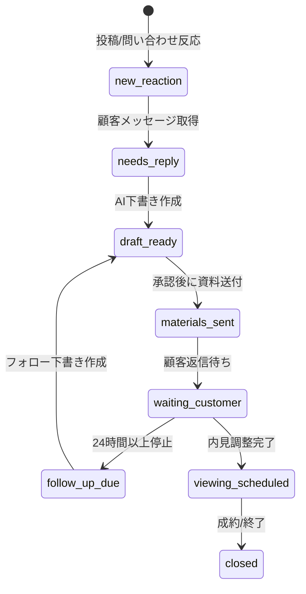
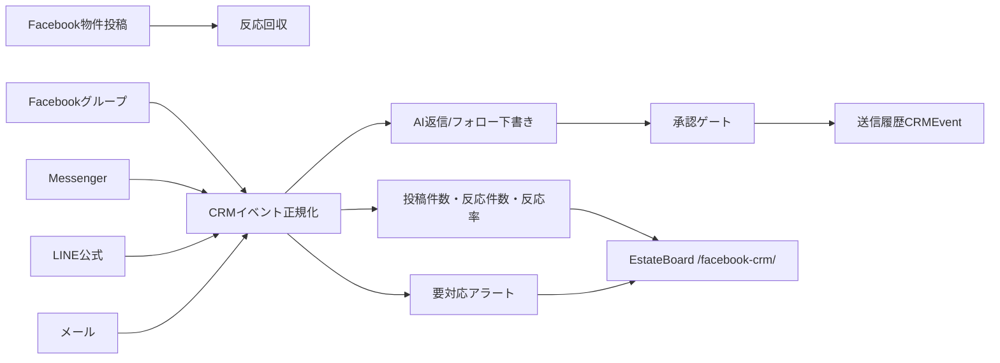

# Multi-channel CRM Dashboard Design

## 対象チャンネル

| チャンネル | 回収する反応 | 推奨連携 | 初期運用 |
|---|---|---|---|
| Facebookグループ | 投稿への反応、コメント、DM誘導 | 既存 `fb-group-autoposter` の投稿キューと反応イベント | 自動計測 + 承認管理 |
| Facebook Messenger | DM問い合わせ | 既存Messenger読み取り補助 + Playwright/手動セッション | 読み取り補助 + 返信下書き |
| LINE公式アカウント | 友だち追加、問い合わせ、リッチメニュー反応 | LINE Messaging API / Webhook | Webhook受信 + 承認後返信 |
| メール | 直接問い合わせ、資料請求 | IMAP/Gmail API + SMTP/Gmail API | 受信分類 + 下書き |

## 1画面UIに入れる情報

1画面は「今日やることがすぐ分かる」ことを最優先にします。

- 上段: 投稿件数、反応件数、反応率、要対応人数、AI下書き件数
- 左: チャンネル別の反応状況
- 中央: 直近反応の顧客リストと現在ステータス
- 右: 次に取るべきアクションとアラート
- 下段: AI返信下書きプレビュー、配信効果の簡易トレンド

## ステータス設計



## システム連携の全体像



## GPT Image用の画面イメージ生成プロンプト

> 日本語の不動産仲介CRMダッシュボード。1画面に収まるWeb UI。上段にKPIカード「投稿件数」「反応件数」「反応率」「要対応」「AI下書き」。左にFacebookグループ、LINE公式、Messenger、メールのチャンネル別カード。中央に直近反応顧客テーブル、ステータスバッジ、物件名、最終反応時刻。右にアラートと次アクション「返信下書きを確認」「フォローアップ」「内見候補送付」。下にAI下書きプレビューと反応率の小さなグラフ。白背景、ネイビーとエメラルド、読みやすい日本語、SaaS管理画面、モダン、レスポンシブ。

## EstateBoard連携JSON

`build_dashboard_payload(events)` は次の構造を出力します。

```json
{
  "schema_version": "estateboard-crm-dashboard/v1",
  "kpi": {"total_events": 10, "unique_customers": 4, "reaction_rate_percent": 33.3},
  "channel_counts": {"facebook_group": 3, "line_official": 4, "email": 2},
  "recent_reactions": [],
  "next_actions": [],
  "channel_capabilities": []
}
```

## 本番に必要なもの

- LINE: `LINE_CHANNEL_SECRET`, `LINE_CHANNEL_ACCESS_TOKEN`
- メール: `GMAIL_CLIENT_ID`, `GMAIL_CLIENT_SECRET`, `GMAIL_REFRESH_TOKEN` または IMAP/SMTP Secret
- EstateBoard同期: `ESTATEBOARD_CRM_WEBHOOK_URL`, `ESTATEBOARD_CRM_WEBHOOK_TOKEN`
- Messenger: ログイン済みブラウザセッションと、手動承認を前提にした読み取り補助
